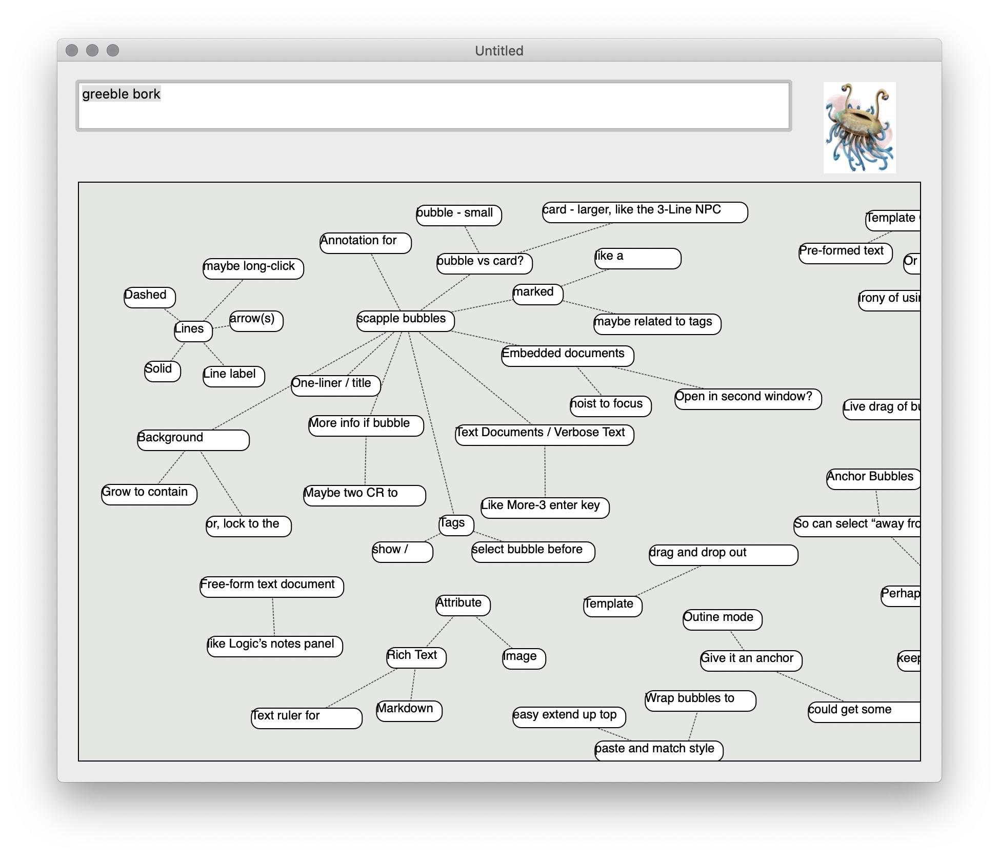
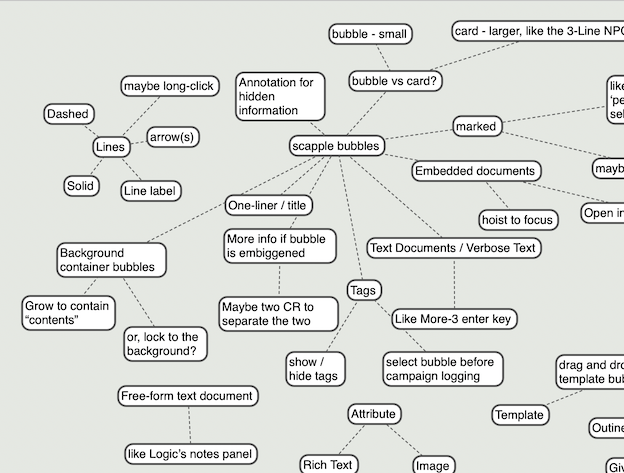
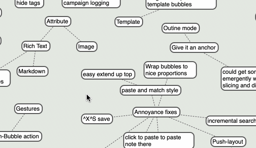
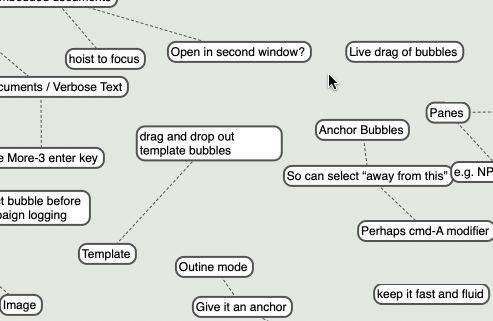
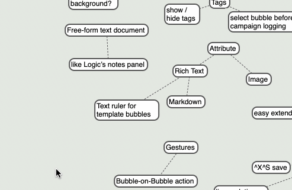
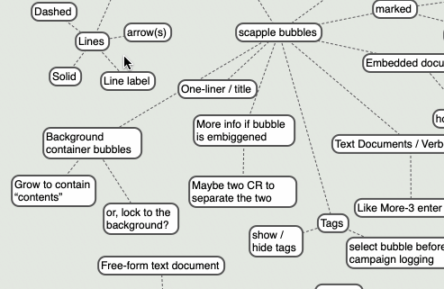
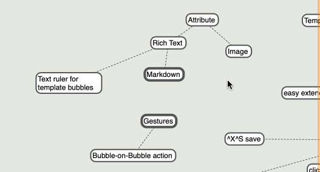
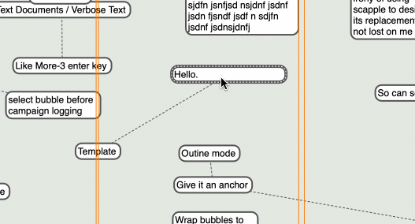
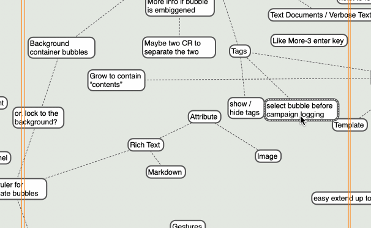
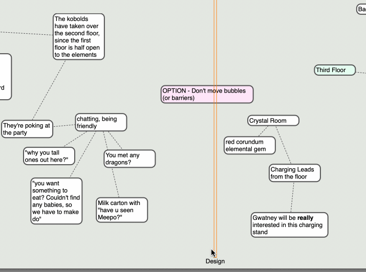

# Borkle

Mind-Mapping for RPG Campaign design and running.

I love love love [Scapple](https://www.literatureandlatte.com/scapple/overview), mind-mapping
software from [Literate and Latte](https://www.literatureandlatte.com), the makers of 
[Scrivener](https://www.literatureandlatte.com/scrivener/overview) (which is also awesome).
I've been using it to design the latest adventure with my DnD group at work.  There's
a [repo](https://github.com/markd2/MarkDnD) with notes and whatnot.

I've been outgrowing it though - I really want Scapple's amazingly simple UI along with
an outline processor, along with some templates for things like NPCs or monster statblocks.

Kinda want Scapple cross-bred with Scrivener.

So, this is my (probably incomplete) attempt of making such a tool before I 
~get distracted~ get a more pressing assignment.

### Future features

Pain points during work:

* Easily add barriers to the right of everything
* Resize bubble while typing
* Find ("wait, what were the kind of mushrooms we found?")
* copy/paste/duplicate bubbles
* modifer-drag on barrier to not move anything

* search
  - text field at top with search criteria
  - maybe grow a sidebar with results
  - key combo to move between them
  - scroll to bubble when focused
  - maybe return to original position when leaving search mode (for in-game 
    note finding)
* Fix the scroll area bounds
* Maybe a bit of overscroll at the edges
* resize bubble when entering text
* resize off the left side with a keypress
* More colors
* color assignable by keystroke

## Deeper Features

Working through a book club book (Building a Second Brain : https://www.buildingasecondbrain.com), thinking more of something like Borkle-styles as the locus of CODEing:

  - Collect - vomit bubbles
  - Organize - make explicit (link) and implicit (tag, position) connections
  - Reduce - show/hide/layout based on relevance
  - Express - Creating Value

Maybe something more tangible will chew its way out of my brain as we work through it.

* would be nice to be able to collapse a hieraerchy (essentially to-the Right/Down),
  but would also be nice to be able to have multiple sets of connection
* like a set of cats.  One way to connect them is by breed (Böb: snowshoe,
  Rusty, Newton, Maggie: Calico), another by owner (Bork: Böb, Newton; Sharz: Böb,
  Rusty, Kassandra: Maggie). Would be nice to be able to have both of those possble,
  and show different slices (or maybe both at the same time - greyed lines, or something,
  or a 3-D projection)
* Would also be nice to be able to tag things and filter by tags, and also implicitly
  connect by tags.  Visibility could be by tag too (say for D&D stuffs, have a DM
  view with :allTheThings:, and one that could be given to the players)
* Thinking in DoD, a table of tags with bubble ID references. Or a table per tag.

# Screenshot Gallery

Might be fun to see the [elvisloution](https://www.youtube.com/watch?v=knc9LKjukSQ) over the ~years~ ~months~ weeks.

### "It Works"

Imports Scapple documents and draws (crudely) the mindmap.  The text field and flumph are
opened and saved to figure out bundle documents.

### Adds some UI

Adds basic interaction - selecting bubbles (click / shift-click / command-click), dragging them
around, mouse-motion highlight, scrolling, undo

### Text Measurement

Figured out how to measure text and get the bubble to resize itself vertically.

### Grabbing Hand Grabs All It Can

Hold down _space_ to engage the grabbing hand for scrolling.

### Rubber-Band Man

Click and drag in "space" to do a basic rubber band selection

### Double-click to create

Double-click in space to create a new bubble

### Remove on delete

Press Delete to remove bubles

### Barriers

Moving a barrier moves everything to the right, letting you make sections you can
easily move stuff in bulk.

### Shift-click in space

Shift-click-dragging in space adds to the current selection.

### Bubble Editing

Double-click a bubble to edit its text.

### Make connections

Drag bubbles on top of another bubble to make (dis) connections

### Move barriers without affecting others

By default barriers move everything to their right.  Which is what
you want most of the time. Sometimes you want to move the barrier
without affecting anything (say for precise positioning, or you've gotten
a couple of accidental overlaps).

Hold down option when clicking on a barrier to prevent it from moving
the bubbles and other barriers.

