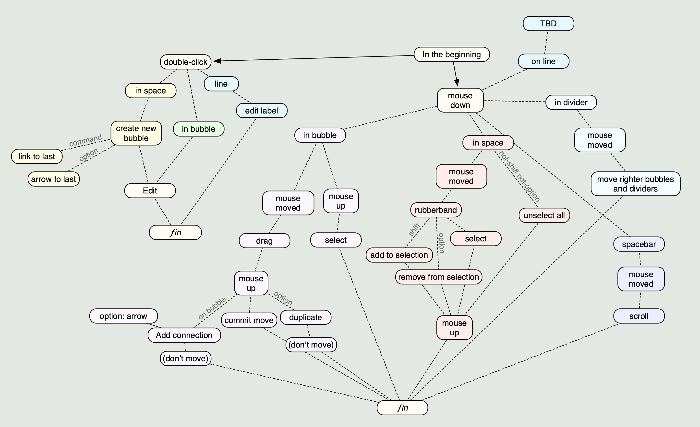

# Wednesday September 9, 2020

* LnL - I love Scapple, just kind of outgrew it for creating making RPG campaigns
* Transferred software notes from markDnD textfile into Sketchings.scap
* Analyzed Scapple save file.  It's delightfully straightforward
* Started looking see if there's any app kit guidance for document-based apps.
  - abandonware - https://developer.apple.com/library/archive/documentation/DataManagement/Conceptual/DocBasedAppProgrammingGuideForOSX/Introduction/Introduction.html
  - https://developer.apple.com/documentation/appkit/documents_data_and_pasteboard/developing_a_document-based_app

- document represented by custom subclass of NSDocument
    - provides most of the behavior for managing your document
    - override or file-tune this behavior by providing custom code for reading and
      writing document data. a.k.a. data model
    - each NSDocument has its own NSWindowController
- NSDocumentController manages multiple documents open
    - Cocoa provides most of hte infrastructure for managing documents
    - with file coordination, version management, and conflict resolution
        - provides the easiest path to using iCloud

NSDocumentController -> NSDocument -> NSWindowController (NSWindow)

- [ ] NSDocument subclass
- [ ] Declare the document type (in xc document types editor) to define the types
      of document type information
      - UTI, identifies a data format
      - Name is human-readable - in Finder
      - Class is NSDocument subclass that handles it
      - Role - editor
      - Bundle turned on. So we can store images, text files, etc.
- [ ] design the document content
      - Document: NSDocument.
      - Has a single Content object
          - "it's easier to add new data elements to the document later"
```
class Content: NSObject {
    @objc dynamic var contentString = ""
    public init(contentString: String) ... etc
}
```
- [ ] uses objc runtime, often use KVC, KVO, bindings, NSCoding
      - therefore model classes should be objc objects and properties @objc
      - properties should be `dynamic` in Swift to use dynamic dispatch for access
- Using a centralized Content object encapsulates the document's data model
  into a single package. If need to add new data elements to your data model
  later, also place them within the content model.
  The model object is therefore responsible for encoding and decoding its content
  for reading and writing to disk

Design the document user interface

MVC.  `Content` is the model.  View is the NSWindow+NSViews,
controller divided amongst various objects including the Document..
The doc's NSWindowController and view hierarchy of NSViewController objects
descend from the window controller's contentViewController

- [ ] `Document` determines which window controllers the document will use
      via `makeWindowController`. It sets a reference to the document object
      as the contentViewController's `representedObject`, allowing the UI
      to bind the document's data model.
      So UI elements get their values through the represented object.

```
override func makeWindowControllers() {
    // Returns the storyboard that contains your document window.
    let storyboard = NSStoryboard(name: NSStoryboard.Name("Main"), bundle: nil)
    if let windowController =
        storyboard.instantiateController(
            withIdentifier: NSStoryboard.SceneIdentifier("Document Window Controller")) as? NSWindowController {
        addWindowController(windowController)
        
        // Set the view controller's represented object as your document.
        if let contentVC = windowController.contentViewController as? ViewController {
            contentVC.representedObject = content
            contentViewController = contentVC
        }
    }
}
```

When organize the user interface into groups of view controllers
called _child view controllers_.  NSVC passes down its `representedObject` to
all of its children.

```
override var representedObject: Any? {
    didSet {
        // Pass down the represented object to all of the child view controllers.
        for child in children {
            child.representedObject = representedObject
        }
    }
}
```

Reading/Writing document content

- [X] at runtime the Document call `read(from:ofType:)` to read in the data of
      a specified type from a file.
- [X] calls `data(ofType:)` function to write a plain text file.

==================================================
# Thursday September 10, 2020

* "Scrivner for RPG planning" and/or "Scrivner and Scapple had a child"

* Want to get something up and running. Kind of infrastructure MVP
  - [X] document-based app
  - [X] image and text file in the bundle
  - [X] save to a file bundle

==================================================
# Friday September 11, 20202

  - [X] polish the file bundle experience
     - [X] interior file names and extensions
     - [X] That runtime warning
     - [X] bundle double-clickable
  - [X] display stuff
  - [X] load file
  - [X] hand-edit bundle and open. yay.
  - [X] let the user edit stuff and save it

ok, that runtime waring


2020-09-11 18:43:22.903437-0400 Borkle[55612:3042353] 

-[NSDocumentController fileExtensionsFromType:] is deprecated
  and does not work when passed a uniform type identifier (UTI). 
  If the application didn't invoke it directly _(which is true)_
  then the problem is probably that some other NSDocument or NSDocumentController
  method is getting confused by a UTI that's not actually declared anywhere. 
  Maybe it should be declared in the UTExportedTypeDeclarations section
  of this app's Info.plist but is 
  not. The alleged UTI in question is "com.borkware.borkle.bundle".

ALLEGED UTI

so UTExportedTypeDeclarations.    I have a com.borkware.borkle.bundle there :-(

There's one in LSItemContentTypes and on in UTExpotedTypeDeclrations.

ok, deleted the LSItemContentTypes. That quieted it.

added conforms to com.apple.package. Didn't work
Added-back-in "CFBundleTypeOSTypes"->"????" %-)

----------

loading file - 

```
    override func read(from fileWrapper: FileWrapper, 
                       ofType typeName: String) throws {
```

pattern:

```
        let fileWrappers = fileWrapper.fileWrappers!

        // load text file
        if let imageFileWrapper = fileWrappers[imageFilename] {
            let imageData = imageFileWrapper.regularFileContents!
            let image = NSImage(data: imageData)
            self.image = image
        }
```

----------

Let the user do stuff.

==================================================
# Saturday September 12, 2020

- [>] Some basic tests for the document
- [ ] Sketch in basic data structure, based on Scapple
- [ ] Scapple import?

I'm not a huge fan of `Document` owning all the data.  It's more controller-y,
dealing with loading and saving.  Plus it'd probably be easier to test stuff
pulling the data storage out of Document.

ALTHOUGH, it'll actually be owning stuff more sophisicated than a text field
and an image.  So maybe that's ok.  Document is responsible for holding on
to the data strucures involved, providing an undo manager, and other
document jazz.

oh no!  my keyboard is failing :-( control key and caps lock :-(

Cleaning up logic for file wrapper - the sample code doesn't make a lot
of sense / is in contradiction to the docs' suggestions for efficiency.
Also taking out the force-unwraps added for expediency

----------

Next, basic data structure - definitely a subset of Scapple's data for now.

What do I want to start out with?
  - Bubble
  - ID
  - Position
  - Width
  - Plain Text
  - connections (IndexSet)

- Bubble (Note)

That'll give a good start to displaying the stuff later.

----------

ok, stuffed some tape under the control key to make the throw shorter, seems
to have worked so far...  but not long enough :-(


----------
for the future

```
protocol Taggable {
    var tags: [String] {get set}
}
```

----------

* XML import works (not pretty, but very quick to hack something together).
* Have a canvas that draws ugly rectangles

* Import the segments
* draw the things

----------

next:

- save bubbles

- scrolling


==================================================
# Sunday September 13, 2020

- [X] save bubbles
   - [X] open last opened document and window position
- [X] scrolling

- [X] mouse motion
- [X] hit testing
- [X] equatable for bubbles
- [X] dragging
- [X] undo
- [X] multiple selection + drag
- [X] select cluster
- [X] watch keystrokes - ^X^S
- [X] properly set bounds

----------

Get some work in before _two_ games today.

----------

added saving (with bundles is really easy.  Shouldn't have been scared of them
over the years), also open lat document and window position. Makes getting
into a runnable state much faster.

----------

Now for scrolling

embed in a scroll view.  Now to remember how NSScrollView works...

NSScrollView hsa three parts:
- NSScrollView
- NSClipView
- Document View

scrollView documentView
scrollView.contentView.scroll(to: CGPoint)

bet it's driven by the frame. Yep.

Getting scroller behavior needed to turn on the scrollers

```
        bubbleScroller.hasHorizontalScroller = true
        bubbleScroller.hasVerticalScroller = true
```

----------

Also consolidaetd some of the useful utilities into one place

----------

ok, mouse motion. It's been a while...

https://developer.apple.com/library/archive/documentation/Cocoa/Conceptual/EventOverview/TrackingAreaObjects/TrackingAreaObjects.html#//apple_ref/doc/uid/10000060i-CH8-SW1

docs

NSTrackingArea seems to be the new hotness
request NSMouseMoved events
can request cursorUpdate (not sure what those are yet)
not sure if NSTrackingActiveInActiveApp or NSTrackingActiveInKeyWindow.
  might need to constraint to front-most window
  there's more, like refinemens of behavr

region is rect in local coordinate.  message recipient is specified when the tracking area is created
to keep up to date
  - appkit will do most of it, but will send updateTrackingAreas to recompute and reset areas

reminder for converting points

```
    override func mouseMoved(with event: NSEvent) {
        let locationInWindow = event.locationInWindow
        let viewLocation = convert(locationInWindow, from: nil)
        selectBubble(at: viewLocation)
    }
```

----------

Added mouse-down handling.  Mouse-over will highlight subtly the bubble. Click selects.

----------

OK! a bit of undo!  Let the canvas tell someone about the update.  Right now transmit out the two
points.  But as we get into this, will probably need to tweedle how we do undo.

This pattern
```

        bubbleCanvas.bubbleMoveUndoCompletion = { bubble, start, end in
            self.setBubblePosition(bubble: bubble, start: end, end: start)
        }

    func setBubblePosition(bubble: Bubble, start: CGPoint, end: CGPoint) {
        bubble.position = end
        bubbleCanvas.needsDisplay = true

        undoManager?.registerUndo(withTarget: self, handler: { (selfTarget) in
                self.setBubblePosition(bubble: bubble, start: end, end: start)
            })
    }
```

----------

10.14.4 adds command-shift-A system wide shortcut for open Apropos in Terminal.
W.T.F?  I love the terminal, but that's a bizarre one to inflict on the system.

https://intellij-support.jetbrains.com/hc/en-us/articles/360005137400-Cmd-Shift-A-hotkey-opens-Terminal-with-apropos-search-instead-of-the-Find-Action-dialog

----------

Got select-all working (got rid of the text fields because responder chain was eating Command.
Now for expand-selection (command-shift-A).  It's showing the menu item disabled.

```
    @IBAction func expandSelection(_ sender: Any) {
        Swift.print("expand selection all")
    }
    
    override func validateMenuItem(_ menuItem: NSMenuItem) -> Bool {
        switch menuItem.action {
        case #selector(expandSelection(_:)):
            return bubbleCanvas.selectedBubbles.count > 0
        default:
            break
        }
        return menuItem.isEnabled
    }
```

now to actually do that.  Pretty easy - walk through each bubble and add its companions.

----------

similarly for resizing the canvas when appropriate.
There's a performance issue - when doing the 'hey highlight this cell", it
redraws the WHOLE CANVAS, burning a lot of time doing all the drawing, so
there's hiccups.

==================================================
# Monday September 14, 2020

(during #dndeux)

Consolidated some of the utilites that have accumulated.

Moved TODO into a github project - https://github.com/markd2/Borkle/projects/1 a.k.a. _pibbit_

Maybe try some string measuring and centering.  yes!  Worked great.

----------

From apple docs from 2006.

http://mirror.informatimago.com/next/developer.apple.com/documentation/Cocoa/Conceptual/TextLayout/TextLayout.pdf

Note: You don’t need to use this technique to find the height of a
single line of text. The NSLayoutManager method
defaultLineHeightForFont: returns that value. The default line height
is the sum of a font’s tallest ascender, plus the absolute value of
its deepest descender, plus its leading.

----------

For calculating height given a fixed width and text

The basic technique for calculating text height uses the three basic
nonview components of the text system: NSTextStorage, NSTextContainer,
and NSLayoutManager

The text storage object holds the string to be measured; 
The text container specifies the width of the layout area; 
The layout manager does the layout and returns the width.


To set up the text system for the calculation, you need 
  - the text string to be measured
  - a font for the string
  - a width for the area modeled by the text container.

```
float heightForStringDrawing(NSString *myString, NSFont *myFont, float *myWidth) {
    // First, you instantiate the needed text objects and hook them together.
    NSTextStorage *textStorage = [[[NSTextStorage alloc] initWithString:myString] autorelease];
    NSTextContainer *textContainer = [[NSTextContainer alloc] initWithContainerSize: NSMakeSize(myWidth, FLT_MAX)];
    NSLayoutManager *layoutManager = [[NSLayoutManager alloc] init];

    // Once the text objects are created, you can hook them together:
    [layoutManager addTextContainer:textContainer];
    [textStorage addLayoutManager:layoutManager];

    // Next, set the font by adding the font attribute to the range of
    // the entire string in the text storage object. Set the line
    // fragment padding to 0 to get an accurate width measurement.
    [textStorage addAttribute: NSFontAttributeName 
           value: myFont 
           range: NSMakeRange(0, [textStorage length]) ];
    [textContainer setLineFragmentPadding: 0.0];

    // Finally, because the layout manager performs layout lazily, on
    // demand, you must force it to lay out the text, even though you
    // don’t need the glyph range returned by this function.
    
    (void)  [layoutManager glyphRangeForTextContainer: textContainer];
    return [layoutManager usedRectForTextContainer: textContainer].size.height;
}
```

----------

OK!  Got some text laying out. Some gimmick with the margin to get it to reneder, but
looks fairly decent.


==================================================
# Tuesday September 15, 2020

Grab hand scrolling.

- [-] hand cursor when spacebar is down
- [ ] click and drag move (c.f. http://borkware.com/quickies/do-search?search=grab+hand)

ugh. event flags vs swift's Character/Int/utf16/deprecations/UGH.

What about just keycodes.  https://boredzo.org/blog/archives/2007-05-22/virtual-key-codes
Spacebar is 49

some idiot wrote: 
 and also use the NSCursor open/closedHandCursor
  oh yeah, cursor rect.

```
    func handCursor(on: Bool) {
        resetCursorRects()
        if on {
            addCursorRect(bounds, cursor: .openHand)
        } else {
            addCursorRect(bounds, cursor: .arrow)
        }
    }
```

That doesn't feel right, but works.

So, trying to do the scrolling. It kind of works, but:
- the first bit of scrolling drops the canvas by 15? pixels
- vertical scrolling gets stuck if the window is resized small
- the hand cursor is return to an arrow without me doing anything :-(

kind of a weird transition

```
NEW ORIGIN (10.02734375, 201.3359375)
SET CURSOR openHand
SET CURSOR closedHand
NEW ORIGIN (10.0, 358.734375)
```

SO, the bit of scrolling drops - if "horizontal bar" isn't turned in IN THE XIB it
doesn't account for it if you turn it on programatically.

The getting stuck seems to be related to not clearing out the interim variables.

the cursor getting reset it still annoying.

ok, needed to do proper cursor handling

```
    func setCursor(_ cursor: Cursor) {
        currentCursor = cursor
        cursor.nscursor.set()
        window?.invalidateCursorRects(for: self)
    }

    // called by invalidate cursor rects
    override func resetCursorRects() {
        addCursorRect(bounds, cursor: currentCursor.nscursor)
    }
```

==================================================
# Wednesday September 16, 2020

The Dungeon Run Night!

do some performance jazz, reducing redrawing.
153 bubbles, drawing 111 at a time, ~80 visible.

Took out the every mousemotion redraw (That was crazy)


==================================================
# Friday September 18, 2020

oh noes took a day off. Bad Bork!

now for some thinking about mouse stuff.  Check out mousings.scap

added _lots_ of thoughts.  BubbleSoup and SelectionSoup come to mind.

Want to start making stuff that's testable (because right now UI and data is terribly conflated).

Would be nice to have the soups that the canvas uses, and all the mouse actions and menu actions are
in terms of the soups.
  - can make fake soups to test
    - don't even have to store bubbles, could hard-code return values
  - simillarly for actions. Pull all that stuff out of the canvas and the bubble class

take a nap and sleep on it :-)

----------

post-nap.

bubbles could turn into structs, the soup vends the bubble struct and makes them have a short
lifecycle

----------

Started on the soup, still treating bubbles as classes, but aiming for changing them to structs.

Next: 
  - make the soup
  - give soup to canvas
  - start with positioning - removing the undo handler from document.


==================================================
# Saturday September 19, 2020

  - make the soup in the document
  - give soup to canvas
  - start with positioning - removing the undo handler from document.

undo fun - need a grouping spanning mouse tracking.
   - but only if actually need to undo something. otherwise empty
     undos get on the stack
   - being kind of oogie and counting begins and end and not doing an end if there's not a 
     corresponding begin.
  - unfortunatley undomanger.groupingLevel goes to two on the first beginGrouping, so can't
    rely on the grouping level for doing latched group begins.  oh well

----------

move the hit test into the soup too (with tests)

----------

sweet - removed explicit bubble array and selection set from the canvas

----------

next - save the soup instead of the bubble array.
  - going to try with the yaml thing / SPM, see how _that_ goes
  - e.g. Yams.

File -> Swift Packages -> etc

extension on file wrapper to give it a string

==================================================
# Sunday September 20, 2020

Still thinking about the complexities of mousifiication.

c.f. mouse-state-machien - 

urg yikes.

The colored areas are articulation regions. So could have a 
  "bubble mouse handler" and  "space mouse handler" and a "spce double click handler"

So the event can pump it with things like

* start
* move to
* finish

It'll either have read/write access to the soup, or somehow come up with a sequence
of changes.

"hey, these bubbles should move from here to there" or "these bubbles should go into select and this set
should go out of selection"

The latter should make it a bit easier for undo / bottleneck the changes.

Then tests can make a scenario, feed in synthetic points, and make sure the proper changes get
emitted.

Some of the actions that can happen:
* select this
* deselcet this
* toggle this

* temporarily drag these
* actuallly move these

* connect these
* disconnect these

* create this
* duplicate this and put at this place
* duplicate these and put at this new place


* scroll canvas

* add marquee
* set marquee rectangle
* remove marquee (automatically removed when processor ends.

A soup-selection-control-protocol that the actions can communicate back through.

----------

to start out with, maybe the rubber-band selection (no modifiers).  This will do
"hey draw stuff" and also selection manipulation


==================================================
# Monday September 21, 2020

more mousings. Since we've got some arcitecture now, move existing stuff out of canvas.

First with the grabhand

thinking init and start should be combned, getting some `!` creeping in

arg, coordinates. Getting weird jumpy scrolling.

----------

ok, jumpiness caused by using view coordinates - which move as the view is scrolled,
so the event coordinates change even though the mouse didn't.

----------

how about some double-click action?  Creation is easy.  Of course, undo makes thing harder.
Need to have `remove` in the soup.

----------

arg, getting lost in the undo miasma again.  Some double-accounting

----------

Next up - adding the barrier.

This is a new type added to the soup plus some new interactions.  *plus*
get something unique going on.


==================================================
# Tuesday September 22, 2020

adding barrier
  - new barrier type (offset, width, label), just plain old array in the document/canvas for now.
  - mouse action architecutre is pretty nice, IIDSSM
  - probably will need a barrier soup so can put undo handling in there
    - yeah, that's going to be useful.
  - 

need ID for barriers


==================================================
# Wednesday September 23, 2020

added ID for barriers
More barrier moving stuff - got bubbles moving properly, got barriers properly moving to.

so the feature works.  Now tests!  :alot: of junk added that needs testing.

out of the gate, barrier soup is 31% coverage and mouseBarrier is 0%

afterwards, 100% barrier soup, 96% mouseBarrier, but covering an || is annoying, so
letting that float for now.

holy geeze 831 net new lines of code.

==================================================
# Thursday September 24, 2020

start moving the mouse logic to a handler.  First pass is a kind of hacky
move all the things, then a second pass will clean things up and make prettier.
Actualy pretty nice.

[ ] still needs to make the modifier-drag work again.
[ ] and now we can write tests for it!


==================================================
# Friday September 25, 2020

[X] still needs to make the modifier-drag work again.
[ ] and now we can write tests for it!

So, making the modifier drag work again.  Thinking that the bubblemouser will need
to hand the single-click stuff as well - basically all the crap out of canvas.

But might make the bubble mouser too complex (but again it'll be more testable...)

[ ] need to add modifier key to the space mouser

next up - tests!


==================================================
# Sunday September 27, 2020

Tests for mouse bubbler.  Started at zero percent coverage (yay)

Ended up 97% - the missing lines are guards that shouldn't happen


==================================================
# Sunday October 11, 2020

Need to do some stuff with modifier keys
  - if shift is down, preserve existing selection while unioning in the newly selected stuff.

Also needed to fix some test flakiness in the bubble mover mouse gasket - the selection
being a Set was confusing the ordering of moved items. A bit of comparable and sorting
later fixes it.

----------

Now for embedding a text editor.

https://developer.apple.com/library/archive/documentation/TextFonts/Conceptual/CocoaTextArchitecture/TextFieldsAndViews/TextFieldsAndViews.html

----------

Was able to add a text view via 

```
    func textEdit(bubble: Bubble) {
        let rect = bubble.rect.insetBy(dx: -2, dy: 3)
        let textView = NSTextView(frame: rect)
        textView.string = bubble.text
        addSubview(textView)
        window?.makeFirstResponder(textView)
    }
```

Some issues
- [X] no way to dismiss, and get the text out of it
- [>] when text field expands, the bubble should expand live (maybe for a polish PR)  (yes)
- [>] attributed text (probably another PR) (ok, definitely)
- [X] there's that padding I'm compensating for to fit in the bubble
   - it's not
     - textContainerInset
     - textContainerOrigin
   - maybe lineFragmentPadding of the TextContainer
     - yes!  that seems useful


oops - bug.  Mouse hits is different Z order than drawing.

==================================================
# Tuesday October 13, 2020

Look at that z-order issue.

yeah, clicks go through.

----------

Connecting / disconnecting.

Adding lots of stuff.  Still need

- [X] Undo
- [ ] highlighting bubbles as they are a potential drop site
      - Scapple does it by highlighting in gray
      - they also don't do live dragging, but instead dragging a transparent image over the field
      - maybe during the mouse drag, see what we're over, and draw that appropriately
- [ ] tests


command-shift-A stopped working for freshly made bubbles.

==================================================
# Saturday October 17, 2020

Happy birthday to me!

ooooops, discovered the latest bits of changes went straight to master.
The danger of programming during #dndeux.


- [X] Undo
- [X] highlighting bubbles as they are a potential drop site
      - Scapple does it by highlighting in gray
      - they also don't do live dragging, but instead dragging a transparent image over the field
      - maybe during the mouse drag, see what we're over, and draw that appropriately
      * decided to go with a thicker orange border.  Covide shows that it's somewhat visible
        for its different vision types.
- [ ] tests
- [ ] probably should break up the mouse support thing - it's starting to sprawl.  maybe some
      of those responsibilities could be moved to the soup

----------

ok, tests!  Found the reason for the failure of the BubblePoint `<` test.  

```
        if lhs.bubble.ID < rhs.bubble.ID { return true }
        else if lhs.point.x < rhs.point.x { return true }
        else if lhs.point.y < rhs.point.y { return true }
        else { return false }
```

Thinking "if LHS isn't less than RHS, then look at the next fields".
BUT, if RHS is truly bigger than LHS, one of the inner tests could override it.
So,

```
        if lhs.bubble.ID < rhs.bubble.ID { return true }
        else if lhs.bubble.ID > lhs.bubble.ID { return false } << oops, lhs > lhs
        else if lhs.point.x < rhs.point.x { return true }
        else if lhs.point.x > rhs.point.x {return false }
        else if lhs.point.y < rhs.point.y { return true }
        else if lhs.point.y > rhs.point.y { return false }
        else { return false }
```

(probably a better way to write it, but it's Just A Test)

and it's not right.  sigh  after rewriting it, noticed the lhs > lhs above %-)

```
        if lhs.bubble.ID < rhs.bubble.ID { return true }
        else if lhs.bubble.ID > lhs.bubble.ID { return false }
        else if lhs.point.x < rhs.point.x { return true }
        else if lhs.point.x > rhs.point.x {return false }
        else if lhs.point.y < rhs.point.y { return true }
        else if lhs.point.y > rhs.point.y { return false }
        else { return false }
```

mouse bubbler and bubble soup went down.  ~need to look at Barrier as well, it's 84%~ (render method)

So need tests for bubble soup.
* [X] connect 1 + undo
* [X] disconect 1 + undo
* [X] connect batch + undo
* [X] disconnect batch + undo

And for the mouse handling. 

For completing coverage, need
* [X] drag called with no selected bubbles
* [X] make originalposition = nil, and call drag. Should bail out not calling support.move.
* [~] during drag, area test returns the hit bubble in an areaTestBubble
      - in general, that should always have the hit bubble in it because that's what's under
        the point.
      - will get done when writing test
* [X] in finish, if hitBubble is nil, bails out.

And actual useful tests
* [X] drag highlights the bubble dragged over, nil if not.
* [X] all the bubble drop stuff.

----------

Now, for rich text - that might be the last big MVP feature.

- [X] import Scapple rich text fooble
  - [X] It's not bringing in :alot: of strings
- [ ] render bubble rich text into an attributed string
- [ ] add attributed string to NSTextView
- [ ] apply styling to NSTextView while editing
- [ ] decompile attributed string to storage format
- [ ] add tests for Scapple import

----------

Importing rich text fooble

```
        <Note>
            <String>Free Names
Darrell Southwell
Smith Dablood
Tilson Cuzad
Direnda
Tandith Axemane
Thunk Boulderblade
KROG
Erin Whitbranch
Ir-mas Vempati</String>
            <Formatting>
                <FormatRange Bold="Yes">0,11</FormatRange>
                <FormatRange Struckthrough="Yes">11,17</FormatRange>
                <FormatRange Struckthrough="Yes">43,13</FormatRange>
            </Formatting>
        </Note>
```

The different types:
  - Bold
  - Struckthrough
  - Italic

can be both
```
                <FormatRange Bold="Yes" Italic="Yes">16,1</FormatRange>
```

There's also FontSize on <Note>

----------

Hrm.  Importing is bringing in a lot of empty text bubbles, but not all of them...
Added to TODO list above

----------


==================================================
# Sunday October 18, 2020

- [X] import Scapple rich text fooble
  - [X] It's not bringing in :alot: of strings
- [X] render bubble rich text into an attributed string
- [X] add attributed string to NSTextView
- [X] decompile attributed string to storage format
- [ ] apply styling to NSTextView while editing
- [X] add tests for Scapple import

Feeling test-y.  So make some Scapple tests.

- [X] empty
- [*] empty bubble
    - can't make
- [X] bubble with text
- [X] two bubbles with connection
- [X] bubble with styled text
- [X] bubble with overlapping styled text
- [X] malformed file (missing closing tag)

Most of the "this should not happen" stuff doesn't have coverage

==================================================
# Wednesday October 21, 2020

Adding attribute string to the NSTextView and decompiling on the way out.
That was pretty easy

setting:
```
        textEditor.textStorage?.setAttributedString(bubble.attributedString)
```


getting:

```
        if let attr = textEditor.textStorage?.attributedSubstring(from: NSMakeRange(0, bubble.text.count)) {
            bubble.gronkulateAttributedString(attr)
        }
```
and enumerating:

```
        let totalRange = NSMakeRange(0, attr.length)

        attr.enumerateAttributes(in: totalRange, options: []) { (attributes: [NSAttributedString.Key : Any], range: NSRange, stop: UnsafeMutablePointer<ObjCBool>) in
            print("SNORGLE \(range)  \(attributes)")
        }
```

SNORGLE {0, 5}  [__C.NSAttributedStringKey(_rawValue: NSFont): "Helvetica 12.00 pt. P [] (0x100c49780) fobj=0x100d0fcc0, spc=3.33"]
SNORGLE {5, 5}  [__C.NSAttributedStringKey(_rawValue: NSFont): "Helvetica-Oblique 12.00 pt. P [] (0x100cba3d0) fobj=0x100b3f410, spc=3.33"]
SNORGLE {10, 5}  [__C.NSAttributedStringKey(_rawValue: NSStrikethrough): 1, __C.NSAttributedStringKey(_rawValue: NSFont): "Helvetica-Oblique 12.00 pt. P [] (0x100cba3d0) fobj=0x100b3f410, spc=3.33"]
SNORGLE {15, 5}  [__C.NSAttributedStringKey(_rawValue: NSStrikethrough): 1, __C.NSAttributedStringKey(_rawValue: NSFont): "Helvetica-BoldOblique 12.00 pt. P [] (0x100a32070) fobj=0x100b4a310, spc=3.33"]
SNORGLE {20, 8}  [__C.NSAttributedStringKey(_rawValue: NSFont): "Helvetica-BoldOblique 12.00 pt. P [] (0x100a32070) fobj=0x100b4a310, spc=3.33", __C.NSAttributedStringKey(_rawValue: NSStrikethrough): 1, __C.NSAttributedStringKey(_rawValue: NSUnderline): 1]
SNORGLE {28, 6}  [__C.NSAttributedStringKey(_rawValue: NSFont): "Helvetica-BoldOblique 12.00 pt. P [] (0x100a32070) fobj=0x100b4a310, spc=3.33", __C.NSAttributedStringKey(_rawValue: NSUnderline): 1]
SNORGLE {34, 11}  [__C.NSAttributedStringKey(_rawValue: NSFont): "Helvetica-Oblique 12.00 pt. P [] (0x100cba3d0) fobj=0x100b3f410, spc=3.33", __C.NSAttributedStringKey(_rawValue: NSUnderline): 1]
SNORGLE {45, 8}  [__C.NSAttributedStringKey(_rawValue: NSFont): "Helvetica-BoldOblique 12.00 pt. P [] (0x100a32070) fobj=0x100b4a310, spc=3.33"]


So can see NSFont tags - Helvetica / Oblique / Bold / BoldOblique
Strikethrough 1, underline 1

A way from NSFont to see if its bold/italic/etc?

ah - 

```
        attr.enumerateAttributes(in: totalRange, options: []) { (attributes: [NSAttributedString.Key : Any], range: NSRange, stop: UnsafeMutablePointer<ObjCBool>) in
            if let font = attributes[.font] as? NSFont {
                let traits = font.fontDescriptor.symbolicTraits

                if traits.contains(.italic) && traits.contains(.bold) {
                    let foption = FormattingOption([.bold, .italic], range: range)
                    formattingOptions.append(foption)
```

==================================================
# Saturday October 24, 2020

This looks like it left, along with some tests.

- [X] apply styling to NSTextView while editing

That was easy

```
extension NSTextView {
    @IBAction func bk_strikethrough(_ sender: Any?) {
        guard let storage = textStorage else { return }

        storage.addAttributes([.strikethroughStyle: NSUnderlineStyle.single.rawValue],
                              range: selectedRange)
    }
}
```

----------

trying to write up Orub notes, and discovered NOTHING WORKS.  Couldn't make bubbles,
couldn't command-A select stuff, and stuff was broken.

----------

Can't make bubbles

* because the useful area is TINY, so clicks go nowhere
  (thank you view debugger)

----------

Not saving.

Maybe the file wrapper files aren't getting cleared on changes?

Bubble soup change hook not getting called.

... bubblesChangedHook is never ever called :-|

TESTS!  MISSING TESTS!  GOOD WORK TERRIE!

(will need to make sure barriers do that too)

----------

Scapple import clobbering stuff

ID conflicts, so the incoming blew away the new stuff.

----------

usability thing - when importing, it blorts the new stuff on top, potentially making 
a real mess.  So select all the incoming bubbles.

----------

Don't have default barriers on new documents.  Now I do (inside of init, get blown
away on load)

----------

some barriers aren't dragging unless there's a bubble to its right (?)

huh.  had way too restrictive logic in the barrier mouser. "if we're not moving
bubbles or affect barriers, do nothing".  But that prevented moving the actual
barrier if there was nothing to the right of it...

==================================================
# Monday October 26, 2020

Did some level design.  Wanting bubble colors.

Added failing test and scapple document.  added implementation. kind of fun.

-----------

Also wanting a select-component for moving islands around.  so added.

----------

==================================================
# Sunday November 1, 2020

After working on the waterworld borkle, wanting some background colors, maybe
line weights.

So want a preset-colors chooser up in the flumph bar
- maybe a one-way, so not needing to keep them in sync right now.

Make a dumb button.

==================================================
# Tuedsay November 24, 2020

Did a bunch of small onesies-twosies.

Next kind of important thing is basic tabs.

```
+-----------------------------------------------+
|                                               |
| [bubble]     [bubble]                         |
|                                               |
+-----------------------------------------------+
| -tab1- | -tab2- | -tab3- |                    |
+--------+--------+--------+--------------------+
```

Why not at the top?  Tabs at the top feel heavy weight, and take up screen realestate higher
in my visual sweet spot.  More like excel spreadsheet tabs rather than safari tabs.

* each tab would be a bubble + barrier document
  - what about IDs?  Can they conflict, or should IDs be document-wide?
  - or maybe the bubble has info(e) on what tab it is on, so it's all in the same bubble        
    document.  Same with barriers.

* does each tab get its own selection?  Or a single one?

* need a way to send a selection to another tab
  - move?
  - copy?
    - if copy, need to renumber

* would be kind of cool to have a bubble that's a gateway to another tab

* kind of getting into the design of the deeper linked / complex documents.

* right now I want it to keep the WaterWorld notes document more tractable.  Up to over 500
  bubbles, and there's a fair amount of scrolling to get to the say the PC's area and
  the current set of notes.

* each tab would export as a page in the PDF

* so things like
    | -world- | -PCs- | -NPCs- | Session 1 | Session 2 | Sessiion 3 | Session 4 |

Thought getting to 8 sessions might be a bit much.
I don't really refer to prior sessions, so reversing it

    | -world- | -PCs- | -NPCs- | Session 4 | Session 3 | Sessiion 2 | Session 1 |

should be fine

==================================================
# Thursday November 26, 2020

more pondering.

Thinking one big happy soup, and each tab has some subset of the soup
  - so it's possible for a bubble to be on more than tab
  - Like NPC cards could be useful
  - what about connctions?  Are those per-tab?
  - "copy to another tab with (or without) connections"
    - that doesn't make me happy
    - maybe the connections are global, but if a bubble is only one tab, but none of its connected
      bubbles, the connections exist, but not shown.
    - totally willing for there to be a usecase that breaks that.
  - should have some kind of sigil for bubble that's in more than one tab
    - location, maybe even rectangle? is on a per-tab basis
  - when we get ability to partially show/hide stuff, that'd be on a per-tab basis.

Also realizing this is going to require the full think-through of all the things.

==================================================
# Monday December 21, 2020

Actually using Borkle for notes for WaterWorld. There's some rough corners,
and some things I wish it did, but it was remarkably useful.

Pondering the stuff from the last note, even though it's been a month (almost)
Plus full of wine, and finished watching Des and Savannah crush everyone
on HGTV.

- But do want to kind of dig in to it being fundamentally an outliner
- not 100% happy with the connections baked in to each bubble (so it's two-ways,
  which may be related to a connection bug saw during waterworld)  If the conncetions
  were external, then the decision of "there is one connection graph" vs "there's
  all sorts of connection graphs - on one page, across pages.  Depending on the
  sophistication of the end documents, I lost my train of thought because Dessert
  is incoming

pausing now to go fix some bugs

----------

ok, bug.

Make two bubbles (1 and 2). Connect 1 to 2.  delete 2. make a new bubble.
connect to 1.  Doesn't actually connect

==================================================
# Wednesday July 26, 2023

Wanting to have a modifier key to suppress region bubble moving.
"I just want to open some space, and I have a some overlapping bubbles
I don't want to move", especailly useful in the early days of a document.

wow, that was easy - just added an if that looks at the options, and then
snarf and barf and tweak a test.

==================================================
# Monday December 11, 2023

Time to break apart the bubble / size / location / connection stuff.

Playfields will be the individual worksheets, which will have bubbles,
and bubbles can have independent size/locations/connections based
on the worksheets.

branch: markd/introduce-worksheets

==================================================
# Tuesday December 12, 2023

At the coffee shop in Shadyside ater the Strauss serenade.

Got playfields sketched in, so things to do like

- [X] migrate documents from all-in-bubbles in to a single playfield
- [X] canvas take a playfield
  - [X] start vectoring all the things through the playfield (if possible)
- [ ] have multiple playfields sharing some subset of bubbles
- [ ] actually save playfields
- [ ] dragonDrop between playfields
  - [ ] drag to link, option-drag to copy

THINGS TO MOVEAY (done)
  - hitTestBubble from soup to playfield
  - areaTestBubbles from soup to playfield
  - inval hook from soup to playfield?
  - enclosingRect from soup to playfield
  - iterate the bubbles from the playfield (since the soup may have more)
etc

(work happens over numerous days)

==================================================
# Thursday December 21, 2023

Got some bugs.  like click selection not working.
